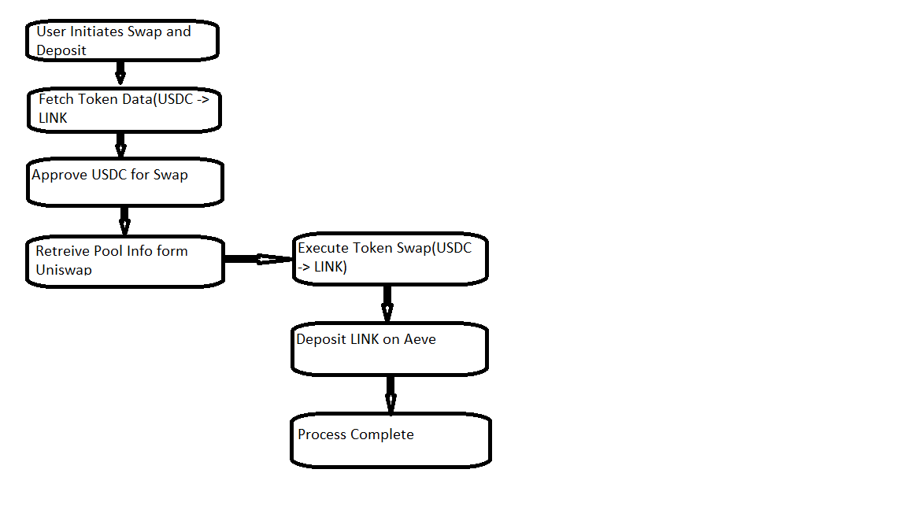

# DeFi Script: Uniswap & Aave Integration

## Overview
This script demonstrates how to interact with multiple DeFi protocols, specifically Uniswap and Aave. The script first swaps USDC for LINK on Uniswap, then supplies the LINK tokens to Aave to earn interest.

## Diagram Illustration

*Example diagram showing token swap on Uniswap followed by supplying the tokens on Aave.*

## Code Explanation
- **Token Swap on Uniswap**: The script fetches the current rate for USDC to LINK and executes the swap using Uniswap's smart contract.
- **Deposit on Aave**: After swapping the tokens, the script deposits the acquired LINK tokens into Aave’s lending pool to start earning interest.

## How to Run the Script
1. Clone the repository.
2. Install dependencies using `npm install`.
3. Set up your environment variables in a `.env` file.
4. Run the script with `node defi-script.js`.

## Additional Notes
- The script is designed for the Ethereum Sepolia testnet.
- Ensure you have sufficient testnet tokens in your wallet for the transactions.
